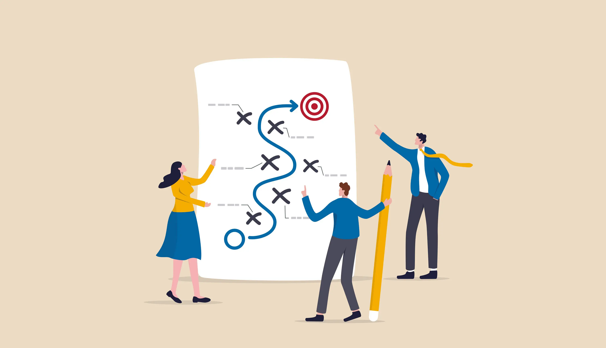

## How I Did Effort Estimation

My effort estimations were primarily based off of historical data. When presented with a task, I would take a look at how long similar tasks have taken me in the past and use that as a starting point. I would then adjust my estimate based on how complex I think the new task was. When a task involved something that I was unfamiliar with I would try to give myself extra headroom to account for learning, debugging, and troubleshooting.

My effort estimations were mostly overshoots but I still did find a benefit for trying to estimate effort. It primarily helped me plan more in depth about what a task would need. I would break a task down and try to think of every step that would be required to complete the task and most times it would lead me to think of areas that I could have trouble. Identifying these areas beforehand would help me to be more prepared for when I start to work on the task and eventually run into those difficulties. I would find myself to be more effective at handling the issues I run into when they came up.

## Tracking Actual Effort

Tracking actual effort was useful to see how much I was undershooting or overshooting and where exactly the time was spent. I timed myself using two seperate stopwatch tabs to see how much time I would spend actually coding and how much time I would spend doing other things such as debugging. Doing this was useful for my future estimates because I could know where I was spending my time and adjust the future estimates based off of my previous estimates. If I would spend more time debugging when implementing a database schema change, I would make sure to give myself more time when doing things that would require more debugging.

## What Would I Do Differently?

I did not use AI when estimating the time it would take to do a task but looking back on it, I definitely could have benefitted from using AI. For me, the main benefit of effort estimation is to plan ahead and think of the problems that you may run into. If I had used AI to help me estimate, I most likely would have scoped out some of the problems that I unexpectedly came across. Another thing that I would change about my effort estimation would be to break tasks down into smaller pieces. I noticed that I would significantly overshoot the time if it was a broad issue which required multiple steps. These multiple steps introduced a less accurate report of time. Whereas if I were to have broken down the task into smaller pieces, I would know exactly where the time was concentrated. For example, if my task was to "implement a page that adds posts to a database" I could break it into smaller pieces like "Create mockup page" "Set up database schema", "Connect form inputs to backend", etc. This would have made my estimates more accurate and meaningful.