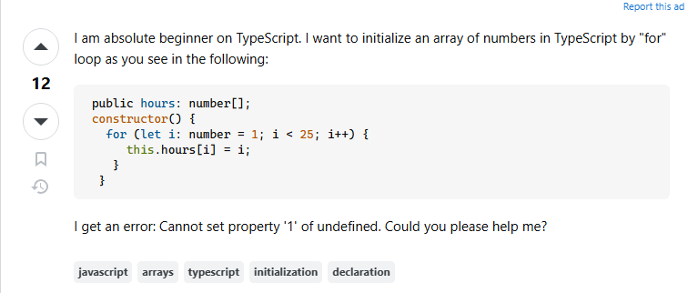
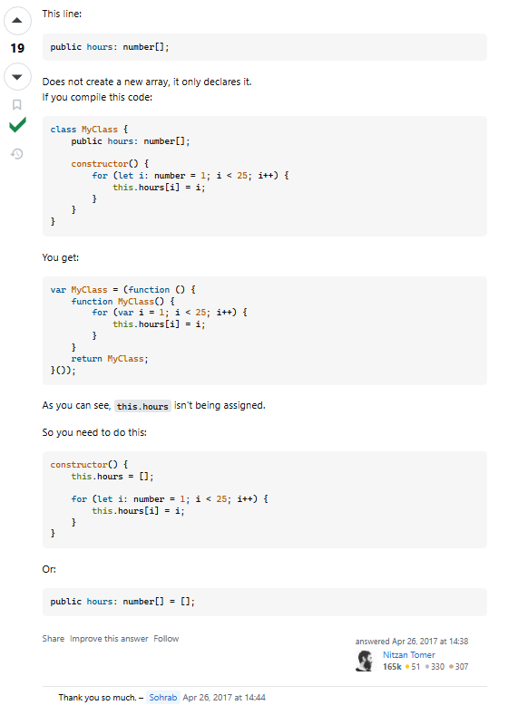

## Understanding the Purpose of a Question

Questions are a tool for learning. This tool, like other tools, can be used in a way to make it more efficient. Questions influence a transfer of information between two people, and in order to make this exchange as efficient as possible it is important to communicate our ideas and uncertainties as clearly as possible. Informed questions that are backed by thought, research, and effort help to sharpen this tool so that it targets the heart of the problem. A lazy question, on the other hand, does the exact opposite. 

## The Benefits of Informed Questions

When a question is considered to be informed, it goes beyond just requesting information. An informed question should be formed in a way that shows others that the asker has put their own effort into understanding and trying to fix the problem. That important aspect of a question will signal to others that you value the answers that you receive. 

Given that effort is put into the problem beforehand, an informed question should be specific. The question should outline exactly what the problem is, what has been attempted, and where the confusion is still at. Specificity helps to make questions easier to answer and also prevents the parties from wasting time clarifying details.

These properties of questions can help people to receive *helpful* answers in a timely and non-stressful manner.

Here is an example of an informed question:



Informed questions don't need to be long to be specific and this user on Stack Overflow demonstrated just that. What makes this question informed? They explained their context, showed their attempt to make the loop, and described the error message that they have encountered. The details that were included helped to give enough information for a helpful answer and it demonstrates that effort was put in to solve the problem beforehand. Since the user checked the boxes of an informed question, they were rewarded with a singular comment that resolved their problem:



## Understanding Lazy Questions

Lazy questions are the opposite of informed questions. These questions lack context, don't show effort, and leave out crucial details. Asking lazy questions forces others to assume your problem rather than understand your problem. The effects of these questions can:
- **Slow down the problem solving process:** Time will be wasted trying to clarify details and understand the problem at hand.
- **Frustrate others trying to help:** When the problem is not stated in a clear manner, others are forced to guess the problem and this wastes their time. 
- **Discourage others from responding at all:** People who come across lazy questions frequently, will be less encouraged to try to help. If the asker isn't showing effort they may think *"Why should I spend my time helping someone who doesn't want to help themselves?*

This would be an example of a lazy question: 

*"Why doesn't my code work? I am getting errors."*
```typescript
function addColors(object1: object, object2: object) {
  this.home[0].color = object1.color + object2.color;
  return object1.color + object2.color;
}
```

This post would be deemed as a lazy question and it's likely that no one would touch it with a 10 foot pole. It's vague and does not provide details that are necessary for understanding the problem. An answer to this could be: 

*"Maybe object1 or object2 doesn't have a color property. Or maybe this.home[0] is undefined."* 

Lazy questions influence lazy answers and the specificity of the answer is directly correlated to the way the question was asked. People need to guess the problem then give their answer to their guessed problem.

How could we turn this into an informed question?
- List the specific errors.
- Give more context about the objects and object data being passed into the function.
- Show that you put effort into the problem beforehand by giving information about what you think the error is based off of debugging attempts.

**Takeaways:**

The differences between informed and lazy questions are related to clarity, effort, and context. A well rounded question not only makes it easier for others to give you helpful answers, but it also demonstrates that you are appreciative and value the answers that you receive. On the other hand, lazy questions force others to compensate for the lack of effort put into forming the question. In the end, asking informed questions is about more than just getting the answer to your problem, it's about communicating at an efficient and collaborative manner while showing respect to the people that are kind enough to help.
