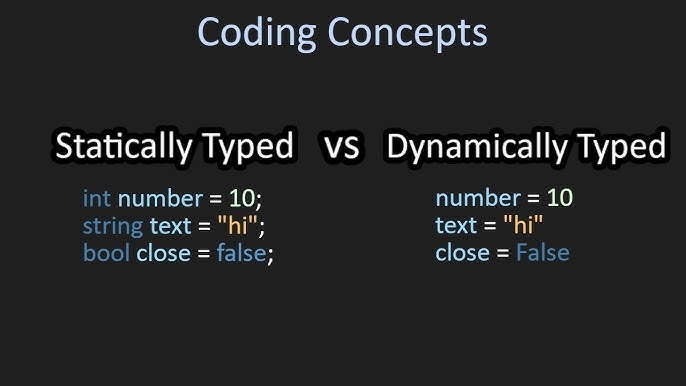

## Static or Dynamic Typing?

Typescript allows for static typing which I think is great in terms of readability. To me, readability is one of the most important things to keep in mind when coding. I want people who view my code to know what is happening and what my intentions were when I wrote it. Static typing aids with this concept of readability by giving you a clearer picture of what variables are intended to do. Another thing I like about static typing is that errors are caught at compile time. This means that type related errors are caught early and you won’t encounter them at runtime which can make finding the error easier.

However, I do think that dynamic typing feels easier and looks cleaner. It’s straightforward and fast with the caveat being a sacrifice of specificity. I think dynamic typing is good if you’re doing something smaller and not hoping for other people to heavily work with your code.

## Athletic Software Engineering

Athletic software engineering is a challenge for me. When I code a solution, I spend a majority of the time thinking about the problem and process that I need to go through. I am rarely in an environment where my thinking time is restricted and this causes my mind to skip beats and just feel real pressure. Although it feels tough right now, I know that this will help me in the long run. With more practice, I am certain that I will feel less pressure and be more confident. Athletic software engineering is important and I think that the skills that I practice during these activities will be apparent when I partake in interviews.
