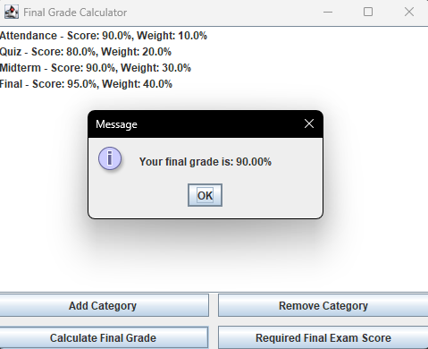

The Final Grade Calculator is an application that I made for personal use. The main goal of this project was to make a program that helps students figure out their overall grade in a class. This program also lets a student see what score would be needed on their final in order to get a desired grade. 

I did this project with the help of AI for the interface. I had little to no experience at the time with creating user interfaces in Java, so I wanted to keep it as simple as I could. I was responsible for the entire project with AI being something that I used to help learn about creating UI's in Java.

This project taught me that I can create a tool that is practical and usable in real life. After this project, I recieved a better understanding of Java and how simple interfaces work. The most important takeaway from this is how satisfying it is to build something that I actually will use time and time again.
 
Source: <a href="https://github.com/andrewBushong/final-grade-calculator">andrewBushong/final-grade-calculator</a>
