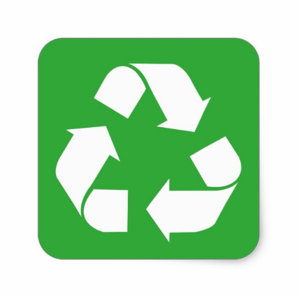

This was a project done in highschool that was focused around recycling in the community. It was held at my highschool and was ran by the Kokua Hawaii Foundation. This event allowed members of the community to drive through the school and drop off a variety of recyclables. The goal of the project was to encourage sustainable practices while having an accessible way to recycle. 

In this project I was responsible for communicating and gathering information that would help the Kokua Foundation with coming to the school and running the event. My role included coordinating with faculty, gathering logistics, and helping to ensure that the community knew what items were acceptable (through advertisement). I worked with the foundation and school staff to make sure that the event would be organized and that the community members would have a good idea of how to take part.

In this project I learned what it was like to manage an event. In this project I overcame challenges such as thinking critically and communicating. This event required me to think critically about the event and to take into account different variables such as drop off efficiency, traffic flow, and safety. The biggest takeaway from this event was the importance and frequency of clear communication. I needed to be able to communicate clearly between the school and the foundation members, I also needed to do this frequently so there was no party left in the dark. 
